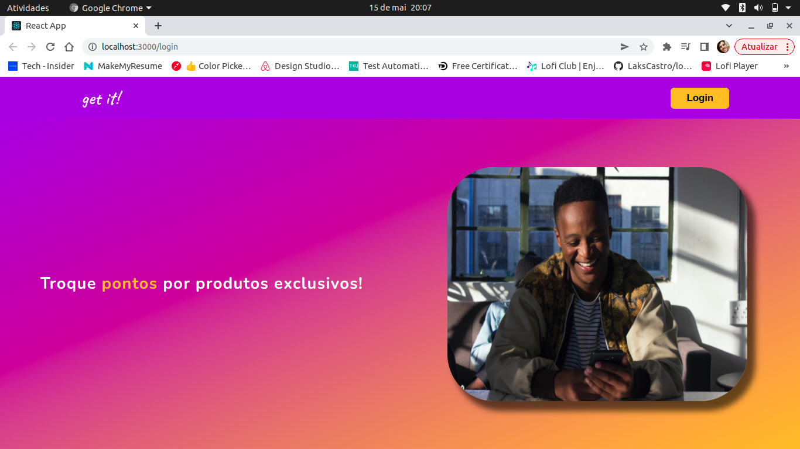
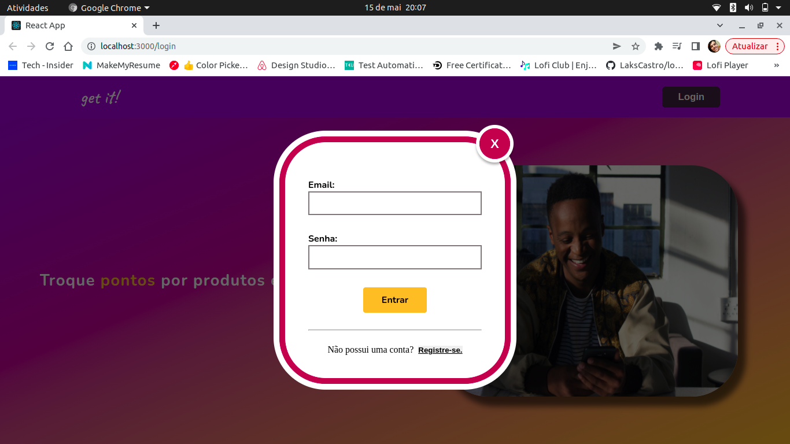

  

  ## Aplicando:

  - Empacotamento da aplicação com Docker;

  - ### backend:
    - Desenvolvimento de API REST com TypeScript e Node.js;
    - Testes com mocha, chai e sinon;
    - Modelação de dados com o MySQL e Sequelize;
  
  - ### frontend:
    - Desenvolvimento das interfaces com React.js;
    - Testes com a biblioteca React Testing Library;
    - Requisições da API com a biblioteca Axios

    ### Demais ferramentas:

    Editor | DevOps
    
    
    
    
    
  

   
  

  # Sobre o teste

  O projeto proposto consiste no desevolvimento frontend e backend de uma plataforma para controle de pontos/moedas com uma loja virtual. A aplicação possui 3 telas para usuários consumidores e administradores, que se comunicam com uma API Rest.
  
    

  ## Para rodar locamente:

  1. Clone o repositório com o comando `git clone git@github.com:guihtryb/get-it-controle-de-pontos.git` em seu terminal;
  2. Entre na pasta criada get-it-controle-de-pontos com o comando `cd get-it-controle-de-pontos` em seu terminal;
  3. Instale as depêndencias do projeto com o comando `npm install` em seu terminal;

  ### Backend
  
  1. Entre na pasta app/backend com o comando `cd app/backend` em seu terminal;
  2. Instale as depêndencias do backend com o comando `npm install` em seu terminal;
  3. Abra uma instância do seu vscode com o comando `code .` ou com seu editor, abra a pasta src/database/config;
  4. Já dentro da pasta, abra o arquivo database.ts;
  5. No objeto config, mude o valor da chave password para a sua senha do mysql e da chave username para o seu usuário mysql;
  6. Execute o comando `npm run db:reset` em seu terminal para criar o Banco de dados;
  7. Execute o comando `npx sequelize db:migrate` em seu terminal para que o Sequelize execute as migrations;
  8. Execute o comando `npx sequelize db:seed:all` em seu terminal para que o Sequelize popule o Banco de dados;
  9. Por fim execute o comando `npm run dev` em seu terminal para que o arquivo server.ts eja executado com o servidor;

  ### Frontend

  1. Abra outra instancia do seu terminal e volte uma pasta com o comando `cd ..`;
  3. Entre na pasta frontend com o comando `cd frontend` em seu terminal;
  4. Instale as depêndencias do frontend com o comando `npm install` em seu terminal;
  5. Execute o comando `npm start` e será aplicação será aberta em uma janela do seu browser;

- Você pode também subir a aplicação com docker, rodando em seu terminal o comando `npm run compose:up`, e então ir até localhost:3000 em seu browser.

  ## Para logar como admin:
  
  - Para logar como administrador, clique no botão Login e utilize o email e senha fictícia;
    - Email: llewis@test.com;
    - Senha: admin_lewis01

  

  

  ## Para logar como usuário:
  
  - Para logar como usuário, clique no botão Login e na parte inferior do campo de Login, vá em `registre-se`;
  - Preencha os campos necessários e, ao clicar em registrar, será criado um novo usuário no Banco de dados;
  - Clique em voltar e realize o login normalmente com email e senha igual aos informados previamente no campo de registro;

  ### Ou

  - Clique no botão Login e utilize o email e senha fictícia;
    - Email: veronicahop@test.com;
    - Senha: VeHooper;

   - Você logará como usuário porém com pontos iniciais;

  

    
    
  

